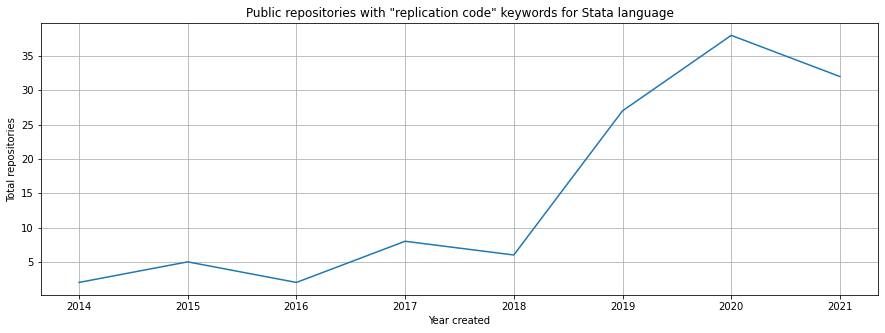

# About

In late March 2021, a friend of mine sent me a paper titled [The influence of hidden researcher decisions in applied microeconomics](https://onlinelibrary.wiley.com/doi/full/10.1111/ecin.12992). Then I read the author's thread on [Twitter](https://twitter.com/nickchk/status/1374058480219213824). That leads me to the following question:

```
Is making replication code more of a norm or an exception to (micro/empirical)economists?
```

It may be true that there are public resources out there, but they may be scattered and not centralized in a place where communities can easily look up to, such as GitHub, where for other programming languages we can see on GitHub [topics](https://github.com/topics) such as [Awesome List](https://github.com/topics/awesome). It's not surprising that economists are not used to sharing stuffs on this place, but fortunately it looks like the numbers are growing recently.

This repository is automatically updated at 12.00 AM UTC every day to nowcast this trend.

# Data source
Currently there are several sources that I'm using.

## GitHub API
The only metric that I use is total numbers of public repositories that use Stata and have "replication code" in the keywords (not case sensitive). Also, it doesn't take into account the field of study in the replication codes. It is possible that people who use Stata also come from fields of study other than economics. Plot example as follows:



## AEA Deposit on ICPSR
American Economic Association deposits, where I scrape all of DOIs of each journal ([nine in total](https://www.aeaweb.org/journals)). Then I compare the proportions of papers that have deposits in [Open Inter-university Consortium for Political and Social Research (ICPSR)](https://www.openicpsr.org/) to total papers published in AEA. The idea is to see the trends of replication over time so I don't have to hard-code the search process which I may overlook. Plot example as follows:


## Work in Progress: Top 10 Econ Journals According to IDEAS/RePEc
See my project list [here](https://github.com/ledwindra/replication-code-economics/projects/1). The idea is to parse metadata from [Crossref](https://github.com/CrossRef/rest-api-doc) for each paper DOI in top ten economics journals according IDEAS/RePEc (full list [here](https://ideas.repec.org/top/top.journals.all.html)). The raw data can be checked on `data/crossref/[JOURNAL-CODE]`. For example:
- `s-aea-aecrev`: American Economic Review
- `s-aea-jeclit`: Journal of Economic Literature
- `s-aea-jecper`: Journal of Economic Perspectives
- `s-bla-jfinan`: Journal of Finance
- `s-eee-jfinec`: Journal of Financial Economics
- `s-kap-jecgro`: Journal of Economic Growth
- `s-oup-qjecon`: The Quarterly Journal of Economics
- `s-oup-rfinst`: Review of Financial Studies
- `s-ucp-jpolec`: Journal of Political Economy
- `s-wly-emetrp`: Econometrica

### Has replication
After getting raw data from Crossref, I crosscheck every DOI to each of the corresponding journal whether it has any replication code/supplementary material or not. The datasets are under `data/has-replication` directory. They are in `.csv` format. See `has_replication` column, where `True` indicates that the corresponding DOI potentially has replication and `False` otherwise.

# PS
There's a potential irony here when I'm creating a repository about reproducibility but my progams won't work in either your machine or on GitHub Actions. It's because the scripts depend on public APIs (e.g. GitHub and Crossref). In addition, some journal websites may undergo a redesign, which makes the functionality of the scripts won't work as intended. Hence I save the raw data too.

In any case, don't hesitate to reach me out or submit issues [here](https://github.com/ledwindra/replication-code-economics/issues).
